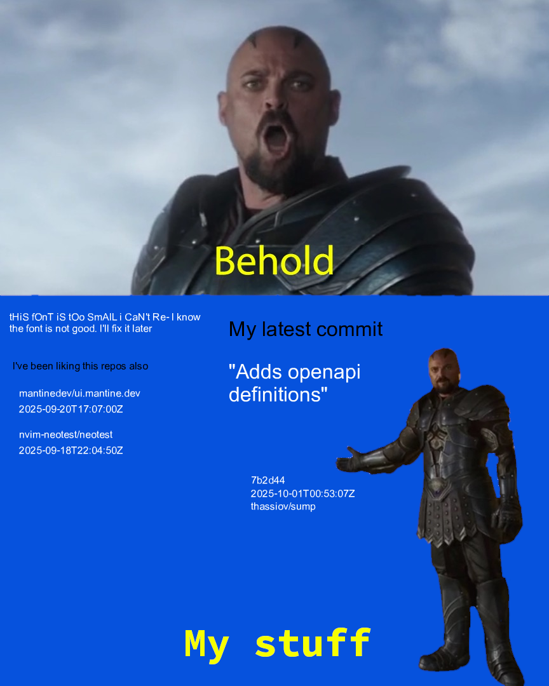

Jokes aside, I'm a backend developer (mostly, but I do some *React* from time to time) that does stuff in *Javascript/Typescript* (95%) and *Go* (5%, but wanting to do more).

## Current project

### mark my words
Study on chrome extension development.
Get text selected in the browser and store it (kind of like [Pocket](https://getpocket.com), but with just text selections).

- Frontend [markmywords-chrome-extension](https://github.com/thassiov/markmywords-chrome-extension)
    - chrome extension using react (and some other stuff - i don't know frontend)
- Backend: [markmywords-backend](https://github.com/thassiov/markmywords-backend) 
    - restful api using typescript, express and sequelize
    - 

--------------- 

  
The image is updated via gh actions

  
  The idea behind it is:
  - call GitHub's REST API (using [@octokit/rest](https://octokit.github.io/rest.js/v20)) for the latests public acitivity in my account
  - filter the latest commit (message, sha, date, repo)
  - filter the 5 latest starred/watched repos (repo, date)
  - edit the [base image](./behold-no-bg.png) using [Jimp](https://github.com/jimp-dev/jimp) to place the text in the _correct_ spot
  - save a new copy of that image, making it overwrite [behold-no-bg-latest.png](./behold-no-bg-latest.png)
  - commit the changes via [this little action](.github/workflows/readme.yml)

  It runs every 10 minutes [or so](https://docs.github.com/en/actions/using-workflows/events-that-trigger-workflows#schedule) and when something changes compared to the last data fetch (in this case, the generated image is diff'ed, so there is that), we commit this changes and the new image is published.

  [The code that does it.](./src/index.ts)

Last updated at: Thu Feb  8 18:37:17 UTC 2024

